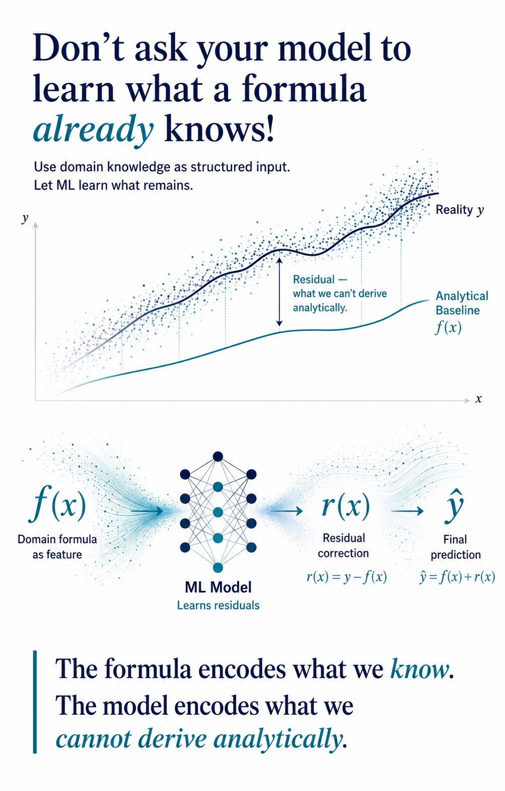

# Encoding Is a Modeling Decision

A project page about choosing categorical encodings according to variable structure rather than applying one generic preprocessing rule.

## Project Website

[View Project Site](https://mah-trigui.github.io/encoding-is-a-modeling-decision/)

## Overview

Categorical encoding is often treated as a routine preprocessing step.

This project takes a different view:

- encoding is part of the modeling decision
- different variables contain different structural assumptions
- representation should reflect what the variable means

## Core Idea

The useful question is not:

- which encoding is best overall?

The better question is:

- what structure does this variable have, and which encoding preserves that structure best?

Examples include:
- ordered categories
- binary contrasts
- noisy high-cardinality groups
- sequential or temporal categories

## Why it matters

- encoding choice changes how the model sees the variable
- uniform encoding can hide useful structure
- better representation often improves tabular modeling more than extra complexity
- the idea generalizes across industrial ML, telecom, and risk modeling

## Architecture

## Key Takeaway

**Choose the encoding that matches the structure of the variable.**

## Public Scope

This repository shares the modeling principle, selected examples, and portfolio presentation only.
